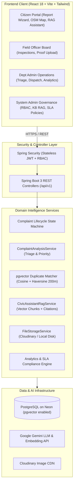
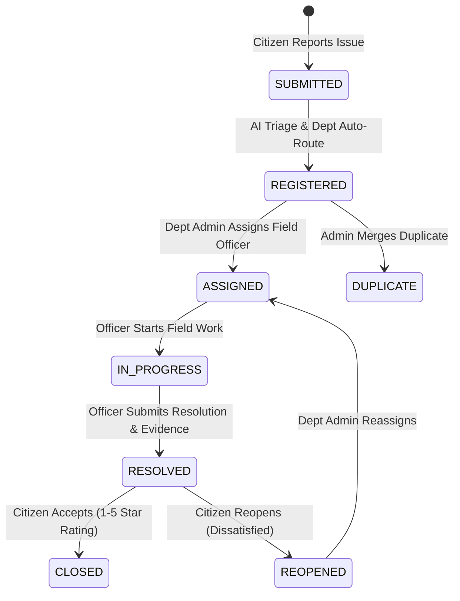

# CivicFix AI – AI-Powered Civic Issue Reporting, Resolution & Monitoring Platform

[](https://adoptium.net)
[](https://spring.io/projects/spring-boot)
[](https://react.dev)
[](https://vitejs.dev)
[](https://tailwindcss.com)
[](https://github.com/pgvector/pgvector)
[](https://ai.google.dev)
[](https://opensource.org/licenses/MIT)

---

## 🌟 Executive Overview

**CivicFix AI** is an enterprise-grade full-stack platform built for modern municipal administrations and smart cities. It streamlines civic grievance management by replacing fragmented manual processes with an automated, AI-augmented resolution lifecycle:

1. **Instant Multi-Modal AI Triage**: When a citizen reports an issue, Google Gemini LLM auto-classifies the category, determines urgency priority (`LOW`, `MEDIUM`, `HIGH`, `CRITICAL`), identifies the responsible department, and generates an executive summary in under 2 seconds.
2. **Spatial & Semantic Duplicate Detection**: 768-dimensional embeddings stored in a `pgvector` column coupled with Haversine spherical distance clustering flags duplicate reports within a 200-meter radius, preventing duplicate municipal work orders.
3. **Grounded RAG Civic Assistant**: A retrieval-augmented conversational assistant answers citizen questions regarding municipal charters, waste schedules, and bylaws strictly using grounded source citations, and provides live status lookups for tracking IDs (e.g., `#CFX-1001`).
4. **Strict SLA Governance & Timeline Auditing**: Enforces server-side transition state machines, automated overdue SLA deadline alerts, field officer workload balancing, and photo evidence verification.
5. **Zero-Dependency Resilient Fallbacks**: If external cloud keys (Gemini, Cloudinary, Neon) are omitted, the application seamlessly activates built-in rule-based AI triage, local vectorizers, local disk storage, and in-memory databases with zero configuration required.

---

## 🏗️ System Architecture



---

## 👥 Role-Based Access Control (RBAC) & Pre-Seeded Personas

The system features 4 role tiers with method-level authorization (`@PreAuthorize`) and frontend route guards. All accounts below are pre-seeded in Flyway migrations:

| Persona | Role | Pre-Seeded Email | Password | Permissions & Capabilities |
| :--- | :--- | :--- | :--- | :--- |
| **System Admin** | `SYSTEM_ADMIN` | `admin@civicfix.ai` | `Admin@12345` | Global system control, user RBAC management, SLA settings, RAG knowledge base chunking, system analytics. |
| **Roads Dept Admin** | `DEPARTMENT_ADMIN` | `roads.admin@civicfix.ai` | `Admin@12345` | Department issue dispatch, officer assignment, SLA monitoring, duplicate review, department analytics. |
| **Field Officer Smith** | `OFFICER` | `officer.smith@civicfix.ai` | `Officer@12345` | Assigned field task list, investigation status update (`IN_PROGRESS`), resolution notes, photographic evidence upload. |
| **Jane Citizen** | `CITIZEN` | `citizen.jane@civicfix.ai` | `Citizen@12345` | Issue submission with GPS pin & photos, AI triage preview, live status tracking, RAG assistant chat, resolution verification & rating. |

*Additional pre-seeded demo accounts:*
- Sanitation Dept Admin: `sanitation.admin@civicfix.ai` / `Admin@12345`
- Electricity Dept Admin: `electricity.admin@civicfix.ai` / `Admin@12345`
- Sanitation Officer Garcia: `officer.garcia@civicfix.ai` / `Officer@12345`
- Electricity Officer Patel: `officer.patel@civicfix.ai` / `Officer@12345`

---

## 🔄 Complaint Resolution State Machine



---

## 🤖 AI Intelligence Layer Details

### 1. Automated Issue Triage (Google Gemini + Safety Rule Fallback)
When a complaint is submitted, `ComplaintAnalysisService` executes a structured JSON-schema prompt against Gemini:
- **Category Classification**: Matches against municipal categories (potholes, garbage dumps, broken streetlights, water leaks, drainage).
- **Urgency Priority**: Computes urgency based on public hazards, proximity to schools/crossings, and safety keywords (sparks, exposed live wire, open manhole -> auto-escalates to `CRITICAL`).
- **Department Routing**: Directs issue to the responsible municipal department.
- **Executive Summary**: Generates a clean 1-sentence summary shown in admin tables.

### 2. Spatial-Semantic Duplicate Detection (`pgvector` + Haversine)
- Uses `text-embedding-004` (768-dimensional normalized vectors) to embed the title and description.
- Executes cosine similarity matching filtered by category and 30-day window.
- Calculates spatial distance via Haversine spherical formula. If a matching complaint is located within 200 meters with $\ge 80\%$ cosine similarity, it is flagged as a potential duplicate.

### 3. Grounded RAG AI Civic Assistant
- Knowledge documents are chunked into ~350-word segments (with 50-word overlaps) and indexed into `knowledge_chunks`.
- User questions retrieve the top-3 most relevant chunks via cosine similarity.
- Gemini is constrained to answer strictly from the retrieved chunks with source citations.
- Citizen query regex intercepts tracking codes (e.g. `#CFX-1001`) and provides live status updates.

---

## 🚀 Getting Started

### Prerequisites
- **Java**: OpenJDK 21 LTS (`java -version`)
- **Maven**: 3.9+ (`mvn -version`) or use the included `mvnw.cmd` wrapper
- **Node.js**: 18+ or 20+ (`node -v`)
- **Docker**: Optional, for containerized run

---

### Method A: Quick Local Start (Zero Configuration Out of the Box)

CivicFix AI runs completely out of the box with zero external configuration using built-in in-memory H2, local vectorizer, local file storage, and rule-based AI fallback.

#### 1. Start Backend
```powershell
cd backend
.\mvnw.cmd spring-boot:run
```
Backend starts on **`http://localhost:8080`**.
OpenAPI Swagger UI is available at: **`http://localhost:8080/api/v1/swagger-ui/index.html`**

#### 2. Start Frontend
```powershell
cd frontend
npm.cmd install
npm.cmd run dev
```
Frontend starts on **`http://localhost:5173`**.

---

### Method B: Docker Compose

```powershell
# Copy environment configuration
cp .env.example .env

# Build and start all containers
docker-compose up --build
```
- Frontend: `http://localhost` or `http://localhost:5173`
- Backend API: `http://localhost:8080`

---

## ☁️ Connecting Cloud Services (Neon, Gemini, Cloudinary)

When you're ready to connect cloud services, simply update your `.env` file:

### 1. Neon PostgreSQL with pgvector
1. Create a free PostgreSQL database at [Neon.tech](https://neon.tech).
2. In the Neon SQL Console, run:
   ```sql
   CREATE EXTENSION IF NOT EXISTS vector;
   ```
3. Set your connection URL in `.env`:
   ```properties
   DB_URL=jdbc:postgresql://ep-xyz.us-east-2.aws.neon.tech/civicfixdb?sslmode=require
   DB_USERNAME=your_neon_user
   DB_PASSWORD=your_neon_password
   ```

### 2. Google Gemini AI API
1. Obtain a free API key at [Google AI Studio](https://aistudio.google.com/app/apikey).
2. Set in `.env`:
   ```properties
   GEMINI_API_KEY=AIzaSy...
   GEMINI_MODEL=gemini-1.5-flash
   ```

### 3. Cloudinary Media Storage
1. Sign up for a free tier account at [Cloudinary](https://cloudinary.com).
2. Set in `.env`:
   ```properties
   CLOUDINARY_CLOUD_NAME=your_cloud_name
   CLOUDINARY_API_KEY=your_api_key
   CLOUDINARY_API_SECRET=your_api_secret
   ```

---

## 📡 REST API Endpoints Overview

| Method | Endpoint | Description | Role Required |
| :--- | :--- | :--- | :--- |
| `POST` | `/api/v1/auth/register` | Register citizen account | Public |
| `POST` | `/api/v1/auth/login` | Authenticate and obtain JWT tokens | Public |
| `POST` | `/api/v1/auth/refresh` | Rotate access token via refresh token | Public |
| `GET` | `/api/v1/complaints/my` | Get current citizen's complaints | `CITIZEN` |
| `POST` | `/api/v1/complaints` | Submit new civic complaint | `CITIZEN` |
| `GET` | `/api/v1/complaints/{id}` | Get complaint details with timeline | Any Authenticated |
| `GET` | `/api/v1/complaints/track/{num}` | Public lookup by tracking number | Public |
| `POST` | `/api/v1/complaints/{id}/assign` | Assign field officer to complaint | `DEPARTMENT_ADMIN`, `SYSTEM_ADMIN` |
| `PATCH` | `/api/v1/complaints/{id}/status` | Move status (`IN_PROGRESS`, etc.) | `OFFICER`, `DEPARTMENT_ADMIN` |
| `POST` | `/api/v1/complaints/{id}/resolve` | Submit resolution notes & evidence | `OFFICER` |
| `POST` | `/api/v1/complaints/{id}/verify` | Citizen verifies (accept/reopen) & rates | `CITIZEN` |
| `POST` | `/api/v1/ai/analyze-preview` | Live Gemini AI triage preview | Public / Authenticated |
| `POST` | `/api/v1/assistant/chat` | Grounded RAG Civic Assistant conversation | Public / Authenticated |
| `GET` | `/api/v1/analytics/department/{id}`| Department SLA & workload metrics | `DEPARTMENT_ADMIN`, `SYSTEM_ADMIN` |
| `GET` | `/api/v1/analytics/system` | System-wide performance overview | `SYSTEM_ADMIN` |
| `POST` | `/api/v1/uploads` | Upload image (Cloudinary or local) | Any Authenticated |

---

## 🧪 Automated Testing & Verification

CivicFix AI includes unit and integration tests covering the state machine, JWT security, AI fallback logic, duplicate detection, and controller flows.

To run tests:
```powershell
cd backend
.\mvnw.cmd test
```

Results: **18 / 18 tests passing** (0 failures, 0 errors).

---

## 🚢 Production Deployment

- **Backend (Render / Railway / Fly.io)**:
  - Docker deployment using `backend/Dockerfile`
  - Set environment variables (`DB_URL`, `DB_USERNAME`, `DB_PASSWORD`, `GEMINI_API_KEY`, etc.)
- **Frontend (Vercel / Netlify)**:
  - Framework Preset: `Vite`
  - Root directory: `frontend`
  - Build command: `npm run build`
  - Output directory: `dist`
  - Set `VITE_API_BASE_URL` pointing to your deployed backend URL.

---

## 📄 License

This project is licensed under the MIT License. Built with ❤️ for smart, accountable, and transparent cities.
